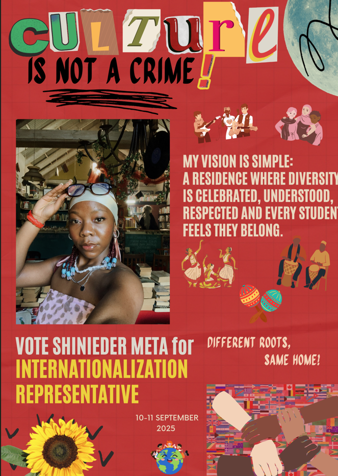
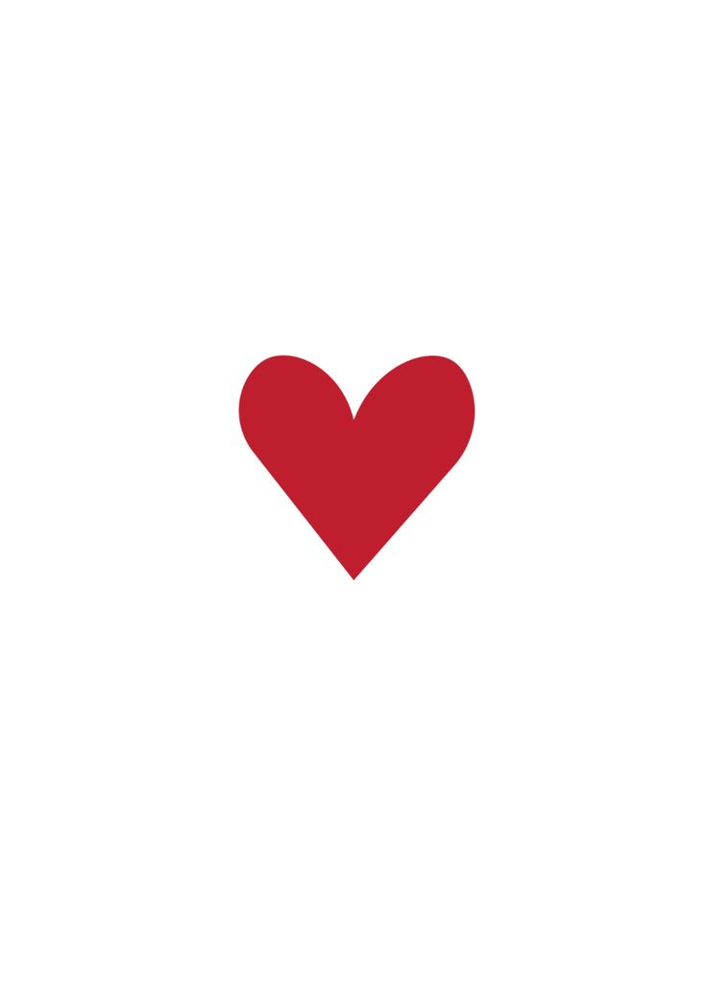
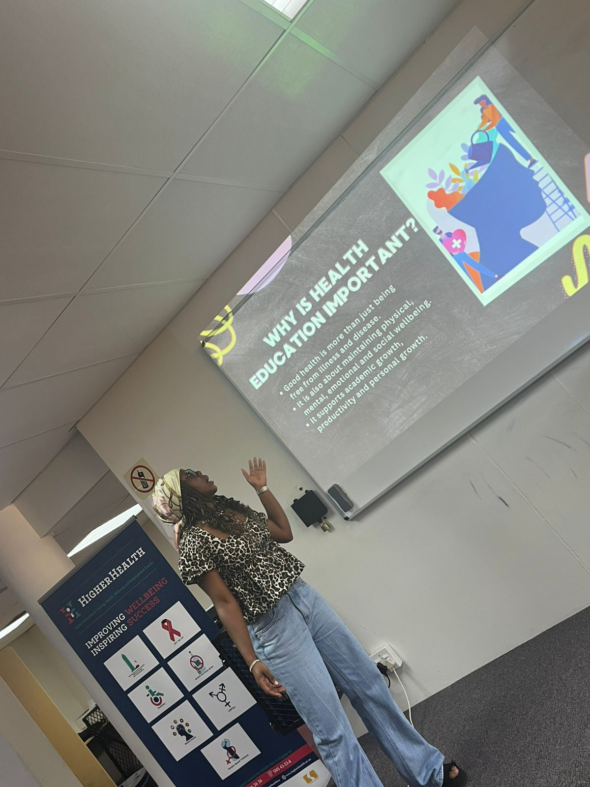
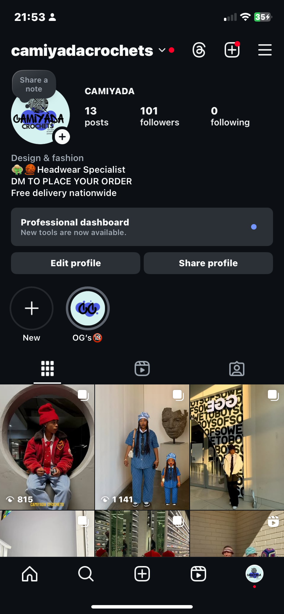

# Vote-Shinieder-to-be-your-internationalisation-representative.
 
  <html> 
    <body bgcolor="#cf2025">       
 <h1 align="middle">SHINIEDER FOR INTERNATIONALISATION REPRESENTATIVE FOR THE YEAR 2026</h1>
    

    <h2 align="middle"></h2>
    <h2 align="middle">Hey Royal Gemmie, thank you for scanning my code. Consider this as your first step to becoming a part of making the right decisions, the next step? Voting for me to be your Internationalisation Representative. </h2>
            
WHO IS SHINIEDER META?

                <h2 align="middle">She is an 18 year old  student who is passionate about her work, creative, stylish, dedicated, energetic, empathetic, oh well the list is long.</h2> 
                    <h2><li> She possesses good leadership and interactive skills.</li>
                    <li>She is Class Representative for more than two modules.</li>
                    <li>Is Media Representive for her Residence Hall.</li>
                         <video controls src="Untitled video - Made with Clipchamp.mp4" width="500" height="500"></video></ul>
                    <li>Is a Peer Educator.  </li>
                    <li>Currently runs her own Crochet business. </li></h2>
        <h1 align="middle">WHY VOTE FOR SHINIEDER?</h1>
        <h2><li>She believes that Internationalisation is about promoting a united community in different effective ways.</li>
        <li>She understands that inclusivity is important within the residence.</li>
        <li>She enjoys engaging and connecting with people from different backgrounds.</li>
        <li>She is willing to learn from the people around her and apply her knowledge effectively.</li></h2>
        <h1>YOUR VOTE IS YOUR VOICE, LETS BUILD A MORE CONNECTED AND INCLUSIVE COMMUNITY TOGETHER.</h1>
       <h4 align="middle">WEBSITE CREATED by SHINIEDER META</h4>
                </body>
</html>
